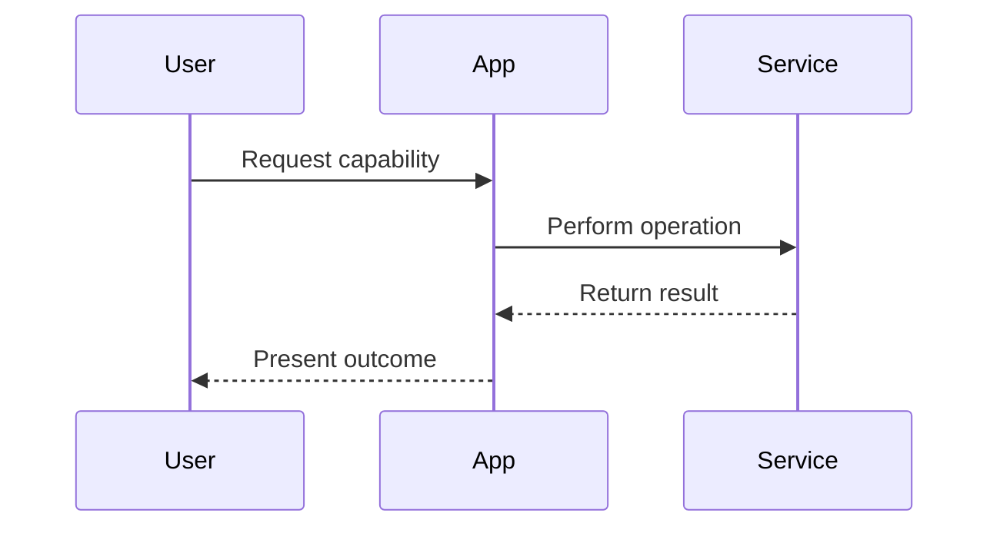

# Kiro Design Reference

Use this reference when writing a Kiro-style `design.md` artifact. Keep the
actual spec concise; this file is guidance for the agent, not content to copy
into the output.

## Canonical Location

Kiro feature specs use three files under a feature-specific directory:

```text
.kiro/specs/<feature-slug>/requirements.md
.kiro/specs/<feature-slug>/design.md
.kiro/specs/<feature-slug>/tasks.md
```

This skill only creates or updates `design.md`, and only after `requirements.md`
is confirmed.

## Requirements-First Design Intent

In the Requirements-First workflow, design follows confirmed behavior. The
design document describes how to implement the requirements and captures the big
picture of how the system works.

The design phase should cover:

- System architecture and components
- Sequence diagrams showing important interactions
- Data models and interfaces
- Technology choices and project-pattern alignment
- Correctness properties and invariants
- Error handling approach
- Testing strategy
- Non-functional concerns called out by requirements

## Recommended File Structure

Use this exact top-level shape for Kiro IDE compatibility. The H1 must be
exactly `# Design Document`; place the feature name in `## Overview` instead of
writing a title such as `# Design: <Feature Name>`.

````markdown
# Design Document

## Overview

One to three paragraphs summarizing the feature name, technical approach,
relevant constraints, and why this approach fits the confirmed requirements.

## Architecture

Describe system boundaries, data flow, service interactions, and
deployment/runtime considerations.



## Components and Interfaces

Describe each component, its responsibility, and its public interface or
contract. Include APIs, service methods, CLI commands, events, configuration, or
external integration contracts when relevant.

## Data Models

Document schemas, types, persistence changes, external payloads, validation
rules, migrations, and compatibility requirements.

## Correctness Properties

Document invariants, consistency rules, ordering guarantees, idempotency
requirements, authorization boundaries, state transitions, and other properties
the implementation must preserve to satisfy the requirements.

### Property 1: <Name>

**Validates: Requirements X.Y**

<Invariant, consistency rule, ordering guarantee, or authorization boundary the
implementation must preserve.>

## Error Handling

Document validation failures, permission failures, downstream failures, retries,
fallbacks, partial failure behavior, user-visible errors, and logging or audit
behavior.

## Testing Strategy

Describe the smallest useful test surface that proves the design satisfies the
requirements. Prefer behavior, contract, and integration tests over
implementation-detail tests.
````

Keep the canonical heading order as `Overview`, `Architecture`,
`Components and Interfaces`, `Data Models`, `Correctness Properties`,
`Error Handling`, then `Testing Strategy`. Do not omit `Components and
Interfaces`, `Data Models`, or `Correctness Properties`, and do not rename the
H1 to include the feature name.

Each property subsection must include an exact bold validates marker:
`**Validates: Requirements X.Y**`. Keep the colon and requirement references
inside the bold marker. Do not bold only the `Validates:` label; Kiro IDE flags
that as missing the property validates reference.

## Traceability Checklist

Before finishing, review the design against the confirmed requirements:

- Every requirement has an implementation path.
- Every acceptance criterion is supported by a component, interface, data model,
  error path, or test strategy.
- No major component exists only because it is interesting or speculative.
- Existing project patterns are reused unless there is a documented reason not
  to.
- Non-functional requirements are addressed explicitly.
- Security, authorization, tenant boundaries, privacy, observability, and
  migration concerns are covered when relevant.
- Open questions are few, concrete, and block implementation if unanswered.

## Mermaid Guidance

Use Mermaid only when it clarifies interaction order or boundaries. Sequence
diagrams are most useful for request flows, async workflows, external
integrations, and failure handling. Keep diagrams small enough to maintain by
hand.

## Source Notes

This guidance follows Kiro's public specs documentation:

- <https://kiro.dev/docs/specs/feature-specs/requirements-first/>
- <https://kiro.dev/docs/specs/feature-specs/>
